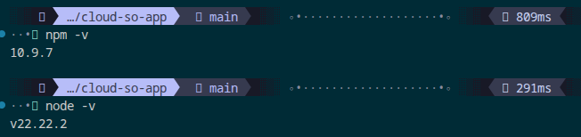
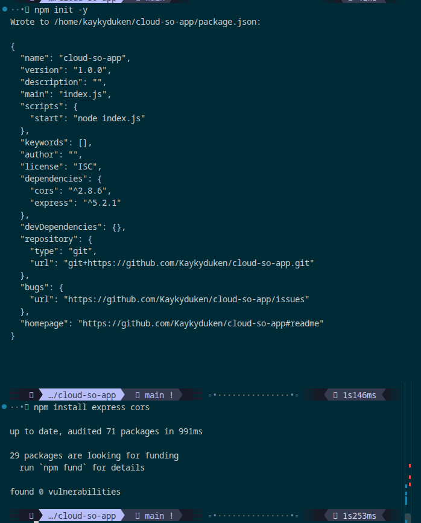
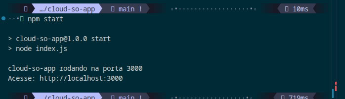
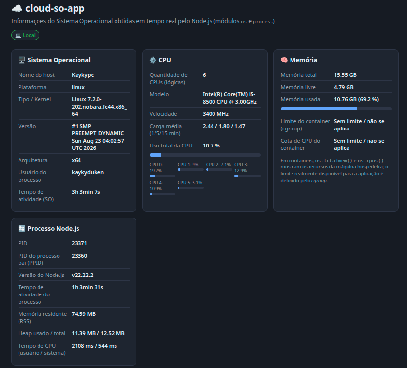
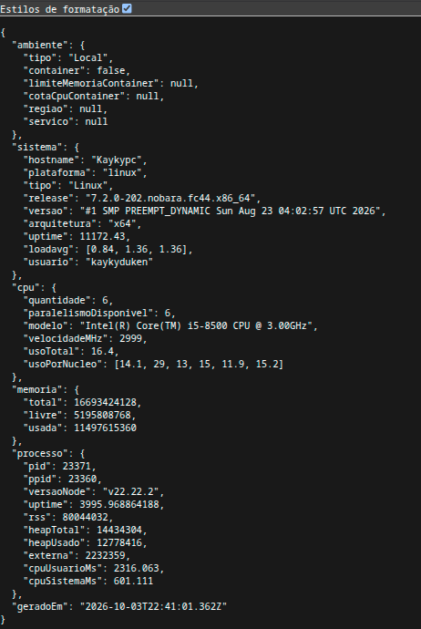
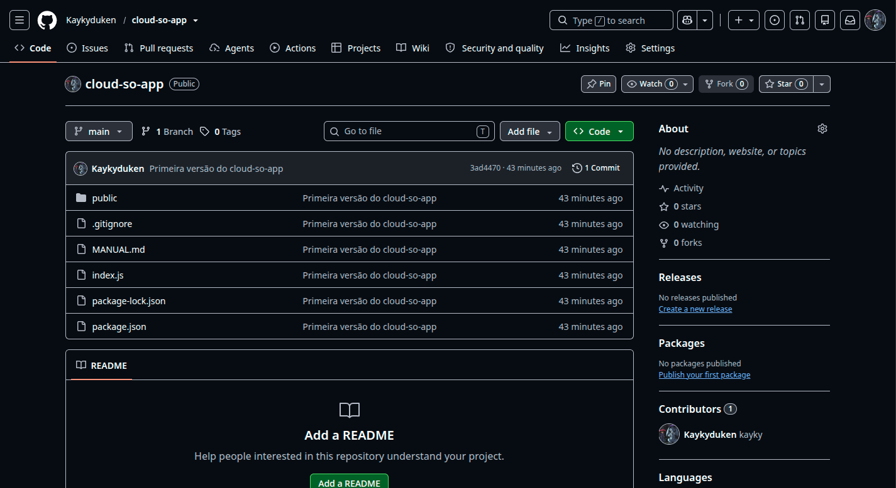
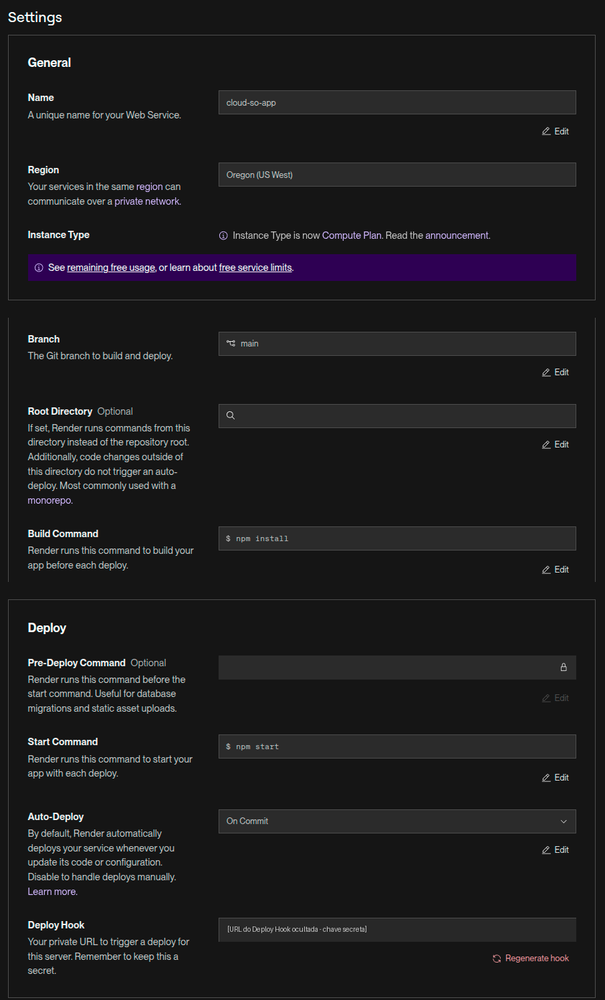
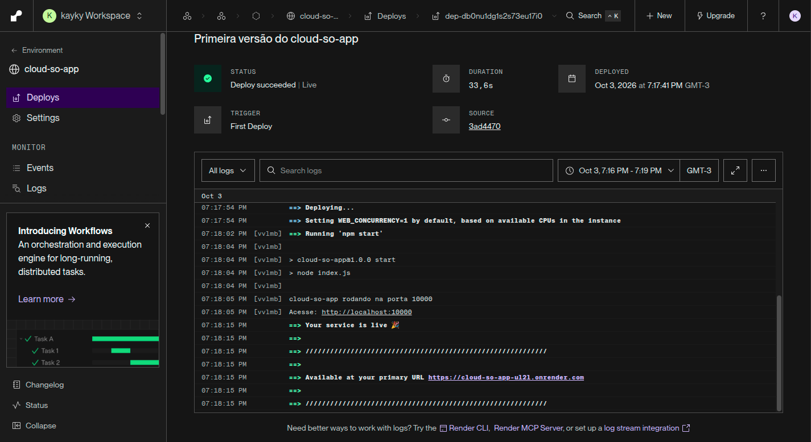
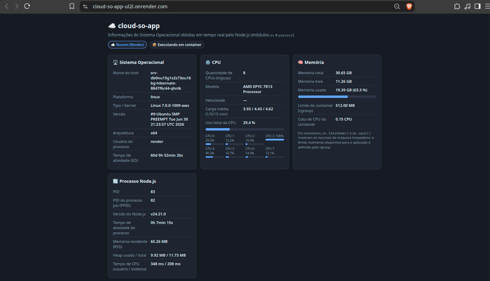

# Manual — cloud-so-app

**Instituição:** Fatec Itapetininga — Análise e Desenvolvimento de Sistemas (3º ciclo)
**Disciplina:** Sistemas Operacionais — Aula 06: Nuvem e Sistemas Operacionais
**Professor:** Prof. Me. Deivison S. Takatu
**Aluno:** Kayky Gabriel Silvano Tomé
**Repositório:** https://github.com/Kaykyduken/cloud-so-app
**Aplicação online:** https://cloud-so-app-ul2l.onrender.com

---

## 1. Objetivo

Desenvolver uma aplicação web com Node.js e Express.js que exibe, em tempo real, informações do sistema operacional onde está sendo executada, publicá-la em nuvem (Render) e comparar os dados obtidos localmente e na nuvem. A comparação é usada para relacionar o projeto com os conceitos de processos, gerenciamento de memória, CPU, sistema operacional hospedeiro, virtualização e computação em nuvem.

## 2. Instalação das ferramentas

Ambiente local: Linux Nobara (base Fedora 44), kernel 7.2.0, processador Intel Core i5-8500 e 16 GB de RAM.

| Ferramenta | Versão | Verificação |
|---|---|---|
| Node.js | v22.22.2 | `node -v` |
| npm | 10.9.7 | `npm -v` |
| Git | 2.55.0 | `git --version` |
| Visual Studio Code | 1.139.1 | `code --version` |

Na primeira tentativa o terminal retornou `npm: comando não encontrado`, porque o Node.js não estava instalado. A instalação foi feita pelo gerenciador de pacotes da distribuição:

```bash
sudo dnf install nodejs nodejs-npm
```

Também foram usadas uma conta no GitHub (hospedagem do código) e uma conta no Render (hospedagem da aplicação), criada com login pelo GitHub.



## 3. Criação do projeto

```bash
mkdir cloud-so-app
cd cloud-so-app
npm init -y
npm install express cors
mkdir public
touch index.js public/index.html .gitignore
```

O `npm init -y` gera o `package.json` e o `npm install` baixa as dependências para a pasta `node_modules` (71 pacotes auditados, 0 vulnerabilidades). No `package.json`, o script padrão `test` foi substituído pelo script de inicialização:

```json
"scripts": {
  "start": "node index.js"
}
```

O arquivo `.gitignore` contém `node_modules/`, para que as dependências não sejam enviadas ao GitHub. Elas são reinstaladas pelo `npm install` em qualquer ambiente.



Estrutura final:

```
cloud-so-app/
├── index.js          # servidor Express e rota /api/info
├── public/
│   └── index.html    # página que exibe os dados
├── package.json
├── package-lock.json
├── .gitignore
└── MANUAL.md
```

## 4. Desenvolvimento da aplicação

### 4.1 Servidor (index.js)

O servidor usa o Express para servir a página estática da pasta `public` e expor três rotas:

| Rota | Função |
|---|---|
| `/` | Página web com as informações |
| `/api/info` | JSON com todos os dados do sistema e do processo |
| `/health` | Retorna `{"status":"ok"}`; usada para verificar se o serviço está no ar |

A porta é definida por `process.env.PORT || 3000`. Localmente a aplicação usa a porta 3000; no Render, a plataforma informa a porta pela variável de ambiente `PORT`; os logs do deploy mostram que ela foi definida como 10000. O middleware `cors` foi incluído conforme o exemplo da aula, permitindo que a API seja consumida por páginas de outros domínios.

### 4.2 Recursos do Node.js utilizados

| Informação | Função | O que retorna |
|---|---|---|
| Nome do host | `os.hostname()` | Nome da máquina na rede |
| Plataforma | `os.platform()` | Família do SO (`linux`, `win32`, `darwin`) |
| Kernel | `os.type()`, `os.release()`, `os.version()` | Tipo, versão e build do kernel |
| Arquitetura | `os.arch()` | Arquitetura do processador (`x64`, `arm64`) |
| CPUs | `os.cpus()` | Lista de núcleos lógicos com modelo, frequência e tempos de uso |
| Carga média | `os.loadavg()` | Média de processos prontos/executando em 1, 5 e 15 min |
| Memória total/livre | `os.totalmem()`, `os.freemem()` | Bytes de RAM total e livre |
| Uptime do SO | `os.uptime()` | Segundos desde o boot do sistema |
| Usuário | `os.userInfo()` | Usuário dono do processo |
| PID / PPID | `process.pid`, `process.ppid` | Identificador do processo e do processo pai |
| Memória do processo | `process.memoryUsage()` | RSS, heap total e heap usado |
| Tempo de CPU do processo | `process.cpuUsage()` | Tempo em modo usuário e em modo sistema |
| Uptime do processo | `process.uptime()` | Segundos desde o início do processo |

Além disso, a aplicação lê arquivos do Linux para obter informações que o módulo `os` não fornece:

- `/sys/fs/cgroup/memory.max` e `/sys/fs/cgroup/cpu.max`: limite de memória e cota de CPU impostos ao container pelo kernel (cgroups).
- `/.dockerenv` e `/proc/1/cgroup`: indícios de execução em container.
- Variável de ambiente `RENDER`: identifica que a aplicação está rodando no Render.

### 4.3 Cálculo do uso de CPU

O `os.cpus()` informa, para cada núcleo, o tempo acumulado em cada estado (`user`, `nice`, `sys`, `idle`, `irq`). A cada segundo, o servidor tira uma nova amostra e calcula:

```
uso (%) = 100 × (1 − Δidle / Δtotal)
```

ou seja, a fração do intervalo em que o núcleo não esteve ocioso.

### 4.4 Página (public/index.html)

A página faz uma requisição `fetch('/api/info')` a cada 2 segundos e atualiza os quatro cartões (Sistema Operacional, CPU, Memória e Processo Node.js). Ela converte bytes para MB/GB e segundos para dias, horas e minutos, mostra barras de uso de CPU e memória e exibe selos indicando o ambiente (Local ou Nuvem) e a execução em container.

## 5. Execução e testes locais

```bash
npm start
```

Saída esperada:

```
cloud-so-app rodando na porta 3000
Acesse: http://localhost:3000
```







| Teste | Esperado | Resultado |
|---|---|---|
| `npm start` | Mensagem "rodando na porta 3000" | OK |
| Acessar `localhost:3000` | Página com os dados atualizando | OK |
| Acessar `localhost:3000/api/info` | JSON com os dados | OK |
| Acessar `localhost:3000/health` | `{"status":"ok"}` | OK |
| Reiniciar o servidor | PID muda, uptime do processo zera, uptime do SO continua | OK |
| Observar a frequência da CPU | Varia conforme a carga | OK: 2554, 2999, 3294, 3400 e 3900 MHz |

### Problemas encontrados no desenvolvimento

| Problema | Causa | Solução |
|---|---|---|
| `npm run test` → "Missing script" | Botão *Debug* do VS Code rodou o script `test`, que foi removido | Executar `npm start` |
| `npm start` encerrava sem mensagem | `index.js` estava vazio | Inserir o código no arquivo |
| "Erro ao consultar /api/info" na página | Página carregada fora do servidor ou em cache | Abrir `http://localhost:3000` e recarregar com Ctrl+Shift+R |
| Selo "container" aparecia localmente | Regra `display` do `.badge` sobrepunha o atributo `hidden` | Adicionar `.badge[hidden] { display: none; }` |

## 6. Publicação no GitHub

```bash
git init
git add .
git commit -m "Primeira versão do cloud-so-app"
git branch -M main
git remote add origin https://github.com/Kaykyduken/cloud-so-app.git
git push -u origin main
```

| Problema | Causa | Solução |
|---|---|---|
| 615 arquivos no commit | `.gitignore` vazio, `node_modules` foi incluído | `git rm -r --cached node_modules` e `git commit --amend` |
| `Repository not found` | URL do remote com o texto de exemplo | `git remote set-url origin <URL correta>` |
| Push rejeitado (`fetch first`) | Repositório remoto já tinha arquivos criados pelo GitHub | O conteúdo remoto foi substituído pelo local; o repositório no GitHub ficou apenas com o commit do projeto |

O GitHub não aceita a senha da conta no terminal; a autenticação usa um *Personal Access Token*.



## 7. Publicação no Render

1. Acessar dashboard.render.com e entrar com a conta do GitHub.
2. **New → Web Service** e conectar o repositório `cloud-so-app`.
3. Configurar:

| Campo | Valor |
|---|---|
| Language | Node |
| Branch | main |
| Region | Oregon (US West) |
| Build Command | `npm install` |
| Start Command | `npm start` |
| Instance Type | Free (512 MB RAM, 0,1 CPU) |
| Auto-Deploy | On Commit |

4. Clicar em **Deploy Web Service** e acompanhar os logs até "Your service is live". O primeiro deploy levou 33,6 s; nos logs aparecem a mensagem `cloud-so-app rodando na porta 10000` e o endereço público https://cloud-so-app-ul2l.onrender.com.

O slide da aula sugere `node` como Build Command, mas esse comando não instala as dependências. Foi usado `npm install`, que instala o Express e o CORS a partir do `package.json`.

A partir daí, cada `git push` para a branch `main` dispara um novo deploy automaticamente (deploy contínuo).







## 8. Comparação entre execução local e em nuvem

| Informação | Local | Render | Análise |
|---|---|---|---|
| Ambiente | Local | Nuvem, em container | O selo "container" só aparece na nuvem |
| Hostname | Kaykypc | srv-db0nu15g1s2s73eu16bg-hibernate-8847f6c44-qhnlk | Nome gerado automaticamente pela plataforma; o formato com sufixos aleatórios é típico de containers orquestrados |
| Kernel | 7.2.0-202.nobara.fc44.x86_64 | 7.0.0-1009-aws (Ubuntu) | O sufixo `-aws` indica que a infraestrutura do Render roda sobre a Amazon Web Services |
| Arquitetura | x64 | x64 | Igual: o mesmo código roda nos dois sem alteração |
| Processador | Intel Core i5-8500 | AMD EPYC 7R13 | Processador de servidor de datacenter |
| CPUs lógicas | 6 | 8 | Número de CPUs visto pelo container é o do hospedeiro |
| Cota de CPU | Sem limite | 0,15 CPU | A aplicação só pode usar 15 % de um núcleo |
| Frequência | 2554 a 3900 MHz | Não informada | A máquina virtual não expõe a frequência real |
| Memória total | 15,55 GB | 30,65 GB | Memória do hospedeiro, não do container |
| Memória usada | 10,76 GB (69,2 %) | 19,39 GB (63,3 %) | Na nuvem, é o uso de todo o hospedeiro, não da aplicação |
| Limite de memória | Sem limite | 512 MB | Limite real, imposto pelo cgroup |
| Uso de CPU | 10,7 % | 29,4 % | Na nuvem, reflete a carga de todos os containers do hospedeiro |
| Carga média | 2,44 / 1,80 / 1,47 | 3,93 / 4,43 / 4,62 | Hospedeiro compartilhado com outros clientes |
| Uptime do SO | 3h03min | 60d 9h52min | O servidor fica ligado continuamente |
| Uptime do processo | 1h03min | 7min15s | O processo é recriado a cada deploy ou retorno da hibernação |
| PID / PPID | 23371 / 23360 | 83 / 82 | No container, PIDs são baixos por causa do namespace de PIDs isolado |
| Usuário | kaykyduken | render | Usuário sem privilégios, isolado do hospedeiro |
| Node.js | v22.22.2 | v24.21.0 | A plataforma escolheu outra versão do runtime |
| RSS do processo | 74,59 MB | 65,26 MB | Consumo da aplicação é parecido nos dois ambientes |

### Principais diferenças observadas

**Recursos visíveis × recursos disponíveis.** Na nuvem, `os.totalmem()` e `os.cpus()` informam 30,65 GB e 8 CPUs, mas a aplicação só pode usar 512 MB e 0,15 CPU. As funções do módulo `os` consultam o kernel, que é compartilhado com o hospedeiro; o limite do container é aplicado separadamente pelos cgroups. Uma aplicação que dimensionasse seus recursos a partir de `os.totalmem()` tentaria usar memória que não tem e seria encerrada pelo sistema.

**Hardware compartilhado.** O uso de CPU de 29,4 % (com um dos núcleos em 100 %) e a carga média de 3,9 a 4,6 não vêm da aplicação, que está praticamente ociosa, e sim de outros serviços que dividem a mesma máquina. Essa é a característica de pool de recursos (multi-tenant) do modelo NIST.

**Ciclo de vida diferente.** Localmente o processo vive enquanto o terminal estiver aberto. No plano Free do Render, o serviço hiberna após 15 minutos sem acessos e é recriado na próxima requisição, o que muda o PID e zera o uptime do processo. O próprio hostname contém a palavra `hibernate`.

Isso foi observado na prática: depois de um novo `git push`, o Render fez outro deploy e a aplicação passou a rodar em um container novo. O hostname mudou de `...-74d894bfc-vvlmb` para `...-8847f6c44-qhnlk`, o PID foi de 81 para 83 e o uptime do SO passou de 71 dias para 60 dias. Como o uptime do SO é o do hospedeiro, a mudança mostra que o novo container foi criado em outro hospedeiro (outra máquina virtual da AWS). Para a aplicação isso é transparente: o endereço continua o mesmo.

**Versão do runtime.** Local e nuvem rodaram versões diferentes do Node.js (22 e 24). Para evitar diferenças de comportamento entre ambientes, a versão pode ser fixada no `package.json`:

```json
"engines": { "node": "22.x" }
```

**Latência.** Localmente a resposta de `/api/info` é praticamente imediata. Na nuvem, cada requisição percorre a internet até o datacenter nos Estados Unidos, já que o Render não tem região no Brasil. O serviço foi criado na região Oregon (US West).

## 9. Conceitos de Sistemas Operacionais na aplicação

### 9.1 Processos

Ao executar `npm start`, o SO cria um processo para o `npm`, que por sua vez cria o processo `node index.js`. Isso aparece na aplicação: localmente o processo tem PID 23371 e PPID 23360 (o `npm`), e no Render tem PID 83 e PPID 82. É a hierarquia de processos pai e filho.

O servidor é um processo de longa duração que fica bloqueado aguardando requisições (estado de espera) e só usa CPU quando uma requisição chega. Ao parar e reiniciar o servidor, um novo processo é criado com outro PID e o uptime do processo volta a zero, enquanto o uptime do SO continua. Isso mostra que processo e sistema operacional têm ciclos de vida independentes.

No container, os PIDs são baixos porque o container possui seu próprio namespace de PIDs: os processos dele não enxergam os processos do hospedeiro e são numerados a partir de 1.

### 9.2 Gerenciamento de memória

A aplicação mostra a memória em dois níveis:

- **Sistema:** memória total, livre e usada (`os.totalmem()` e `os.freemem()`). Localmente, 69,2 % dos 15,55 GB (10,76 GB) estavam em uso por todos os programas da máquina.
- **Processo:** o RSS (*Resident Set Size*) é a quantidade de memória física que o processo ocupa, cerca de 65 a 75 MB. Dentro dele, o heap do V8, onde ficam os objetos JavaScript, ocupa só 10 a 11 MB. O restante é o próprio runtime do Node.js, o código compilado e as bibliotecas carregadas.

Na nuvem, o kernel aplica um limite de 512 MB ao container por meio dos cgroups. Se o processo ultrapassar esse valor, o kernel o encerra (OOM kill), mesmo que a máquina hospedeira tenha memória livre. Esse limite não é visível em `os.totalmem()`, apenas no arquivo `/sys/fs/cgroup/memory.max`.

### 9.3 Uso de CPU

O uso de CPU é calculado a partir dos tempos que o kernel contabiliza para cada núcleo em cada estado (usuário, sistema, ocioso). O processo também separa seu tempo em **modo usuário** (executando o código JavaScript) e **modo sistema** (o kernel atendendo chamadas de sistema como leitura de arquivos e rede): localmente 2108 ms e 544 ms (processo ativo havia cerca de 1 hora); no Render, 348 ms e 208 ms (processo ativo havia cerca de 7 minutos).

Foram observados dois mecanismos de gerenciamento de CPU:

- **Escalonamento de frequência:** localmente, a frequência do i5-8500 variou entre 2554, 2999, 3294, 3400 e 3900 MHz (turbo), ajustada pelo SO e pelo processador conforme a carga.
- **Cota de CPU:** no Render, o container enxerga 8 CPUs, mas o escalonador do kernel limita o processo a 0,15 CPU (15 ms de execução a cada 100 ms), configurado no arquivo `cpu.max` do cgroup.

A carga média (`os.loadavg()`) indica quantos processos, em média, estavam executando ou aguardando CPU. Na máquina local, cerca de 2,4 em 6 núcleos indica uso leve, vindo dos programas abertos pelo próprio usuário; no hospedeiro do Render, cerca de 4 em 8 núcleos vem de outros serviços que dividem a máquina, já que a aplicação estava praticamente ociosa.

### 9.4 Sistema operacional hospedeiro

O sistema operacional é a camada que abstrai o hardware e gerencia os recursos. Localmente, a aplicação roda diretamente sobre o Linux Nobara instalado no computador. No Render, o kernel reportado é `7.0.0-1009-aws`, de um Ubuntu preparado para a AWS: esse é o SO hospedeiro.

Um container não possui kernel próprio, ele compartilha o kernel do hospedeiro. Por isso `os.release()`, `os.uptime()` (60 dias), `os.cpus()` e `os.totalmem()` retornam dados do hospedeiro, enquanto o isolamento do container é feito por namespaces (PIDs, hostname, sistema de arquivos) e cgroups (limites de memória e CPU).

### 9.5 Virtualização e containers

A execução no Render envolve várias camadas de abstração:

```
Hardware físico (servidor AMD EPYC no datacenter da AWS)
  └── Hypervisor da AWS
       └── Máquina virtual com Ubuntu (kernel 7.0.0-1009-aws)
            └── Container da aplicação (512 MB, 0,15 CPU)
                 └── Processo node index.js
```

Indícios da virtualização encontrados nos dados: o kernel com sufixo `-aws`, o processador EPYC 7R13 (modelo usado em instâncias da AWS) e a frequência da CPU não informada, já que a máquina virtual não expõe o valor real do hardware.

A diferença entre as duas tecnologias aparece no projeto: uma **máquina virtual** tem seu próprio kernel, executado sobre o hypervisor; um **container** é um processo isolado que compartilha o kernel do SO hospedeiro, por isso é mais leve e inicia mais rápido. O formato do hostname (com sufixos aleatórios) é característico de containers gerenciados por um orquestrador.

### 9.6 Computação em nuvem

O Render é um serviço **PaaS** (Plataforma como Serviço): foi necessário apenas enviar o código e informar os comandos de build e start. O provedor cuidou do SO, do runtime Node.js, da rede, do HTTPS e do monitoramento. A própria plataforma, por sua vez, roda sobre a infraestrutura (IaaS) da AWS.

Características do modelo NIST observadas na prática:

| Característica | Onde aparece no projeto |
|---|---|
| Autoatendimento sob demanda | Serviço criado pelo painel, sem contato com o provedor |
| Amplo acesso à rede | Aplicação acessível por qualquer navegador pela internet |
| Pool de recursos | Hospedeiro com 8 CPUs e 30 GB compartilhado entre vários containers |
| Elasticidade | Serviço desligado sem uso e recriado sob demanda (hibernação) |
| Serviço mensurável | Plano definido por cota de memória e CPU (512 MB, 0,15 CPU) |

Desafios da nuvem também ficaram visíveis: latência (datacenter fora do país), recursos limitados no plano gratuito e o tempo de inicialização após a hibernação (*cold start*).

## 10. Conclusões

A mesma aplicação, sem nenhuma alteração no código, rodou localmente e na nuvem, mas os dados exibidos mostraram ambientes muito diferentes. Localmente, a aplicação tem acesso a todos os recursos da máquina. Na nuvem, ela roda dentro de um container, numa máquina virtual, sobre um servidor físico compartilhado.

A principal lição foi a diferença entre os recursos que o sistema informa e os que a aplicação pode usar: o container enxerga 30 GB de RAM e 8 CPUs, mas está limitado a 512 MB e 0,15 CPU pelo kernel. Isso mostra que conceitos de Sistemas Operacionais (processos, escalonamento, gerenciamento de memória, namespaces e cgroups) são a base sobre a qual a computação em nuvem é construída.

O plano gratuito do Render atendeu bem ao propósito acadêmico, com deploy contínuo a partir do GitHub e HTTPS incluso, mas suas limitações (hibernação, pouca CPU e latência) mostram por que aplicações em produção precisam de planos dimensionados para a demanda.

Como melhorias, a versão do Node.js pode ser fixada no `package.json` para garantir o mesmo runtime nos dois ambientes, e a aplicação poderia exibir o limite real de memória do container como "memória disponível" em vez do valor do hospedeiro.

## 11. Referências

- TANENBAUM, A. S.; BOS, H. *Sistemas Operacionais Modernos*. 4. ed. São Paulo: Pearson, 2016.
- SILBERSCHATZ, A.; GALVIN, P. B.; GAGNE, G. *Fundamentos de Sistemas Operacionais*. 9. ed. Rio de Janeiro: LTC, 2015.
- STALLINGS, W. *Sistemas Operacionais: Conceitos e Projetos*. 8. ed. São Paulo: Pearson, 2015.
- MELL, P.; GRANCE, T. *The NIST Definition of Cloud Computing* (SP 800-145). NIST, 2011.
- NODE.JS. *OS module*. Disponível em: https://nodejs.org/api/os.html
- RENDER. *Documentation*. Disponível em: https://render.com/docs
- TAKATU, D. S. *Aula 06 — Nuvem e Sistemas Operacionais*. Fatec, 2026.
